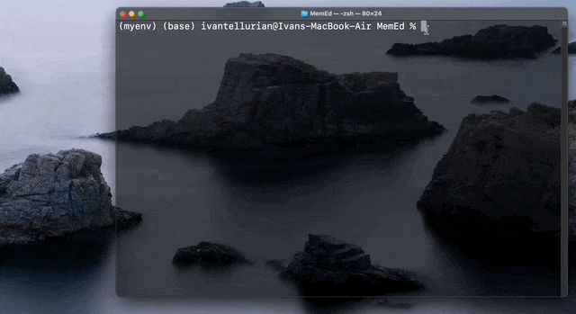

# MemEd
A meme viewer app. It's implemented in Python and it works inside a terminal/command prompt.



## Run It:

To run this program you should open the terminal at the same directory as your MemEd.py program, and then type:

```
python MemEd.py
```
